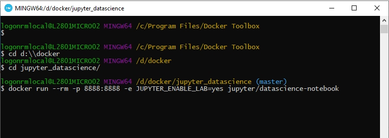

# JUPYTER DATA SCIENCE

Ambiente para estudo com Julia, Python e R em docker.

## SOFTWARES NECESSÁRIOS
#### Para a criação e uso do ambiente vamos utilizar git e docker
   * Instalação do Docker no [Windows ou Mac](https://docs.docker.com/toolbox/overview/) ou no [Linux](https://docs.docker.com/install/linux/docker-ce/ubuntu/)
   *  [Instalação do git](https://git-scm.com/book/pt-br/v2/Come%C3%A7ando-Instalando-o-Git)

## SETUP
*OBS: Esse passo deve ser realizado apena uma vez. Após o ambiente criado, utilizar o docker run para iniciar os containers como mostrado no tópico INICIANDO O AMBIENTE*

#### Criação do diretório docker
   *  No Windows:
      *  Criar na raiz do seu drive o diretório docker
         ex: D:\docker ou C:\docker
          
   * No Linux:
      * Criar o diretório na home do usuário
        ex: /home/user/docker
          
#### Baixar o repo dentro diretório docker
          git clone https://github.com/fabiogjardim/jupyter_datascience.git

### Ajustes no Windows
   * *Abrir o Docker Quickstart Terminal*
   

   * *Executar o arquivo virtualbox_config.bat*
       <i>O arquivo bat altera a VM default para 2GB de memória, adiciona o drive do repo compartilhado como /d e faz o mapeamento da porta 8888 para acesso local</i> 
      
       <i>OBS: se o ser driver raiz for diferente de C:, altere o arquivo virutalbox_config.bat na parte indicada no comentário. A memória pode ser alterada também, basta editar o arquivo.</i> 

   
## INICIANDO O AMBIENTE
   
  *No Windows abrir o Docker Quickstart Terminal, do Linux um terminal*

  *No modo sem pasta compartilhada, tudo que for salva no docker é perdido quando ele é reiniciado*

### Em um terminal, no diretorio jupyter_datascience, executar o docker run

    docker run --rm -p 8888:8888 --name jupyter -e JUPYTER_ENABLE_LAB=yes jupyter/datascience-notebook       

  *Acesse o Jupyter pelo link indicado com a chave de acesso*

 <i>O link destacado é o endereço de acesso ao Jupyter Lab</i> 

## INICIANDO O AMBIENTE COM PASTA COMPARTILHADA
   
  *No Windows abrir o Docker Quickstart Terminal, do Linux um terminal*

### Em um terminal, no diretorio jupyter_datascience, executar o docker run
   *  No Windows:
   
    docker run --rm -p 8888:8888 --name jupyter -e JUPYTER_ENABLE_LAB=yes -v /c/docker/jupyter_datascience:/home/jovyan/work jupyter/datascience-notebook       

   *  No Linux:

    docker run --rm -p 8888:8888 -e JUPYTER_ENABLE_LAB=yes -v "$PWD":/home/jovyan/work jupyter/datascience-notebook

## SOLUCIONANDO PROBLEMAS 
   
  *No Windows abrir o Docker Quickstart Terminal*

### Parar um container
         docker stop jupyter      

### Remover um container
         docker rm jupyter

### Dados do container
         docker container inspect jupyter

### Acessar log do container
         docker container logs jupyter 

  *OBS: Caso percam o link de acesso ao Jupyter, basta acessar o log para vizualizar novamente*
  
## Imagens   

[Docker Hub Original](https://hub.docker.com/r/jupyter/datascience-notebook)

## Documentação Oficial

* https://jupyter-docker-stacks.readthedocs.io/en/latest/index.html
* https://docs.python.org/3/
* https://www.r-project.org/other-docs.html
* https://docs.julialang.org/en/v1/
