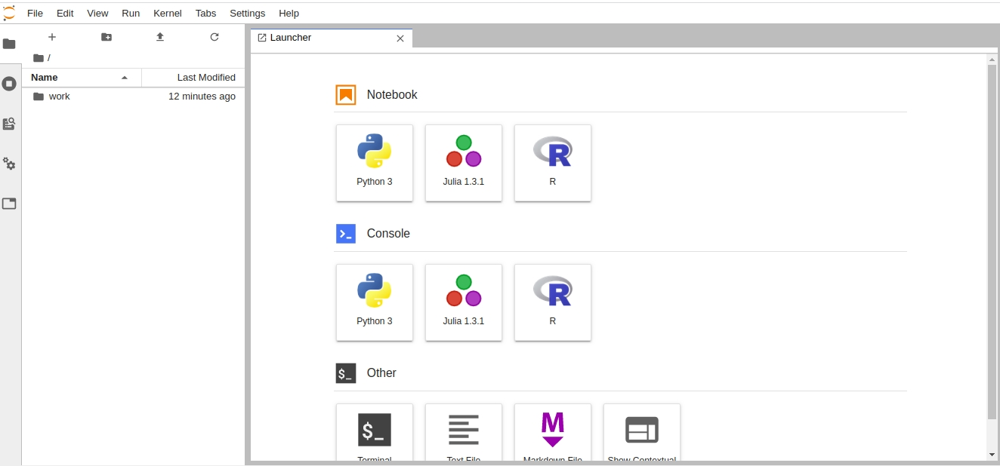
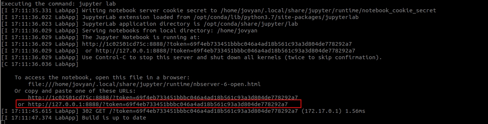

# JUPYTER DATA SCIENCE

Ambiente para estudo com Julia, Python e R em docker.

## SOFTWARES NECESSÁRIOS
#### Para a criação e uso do ambiente vamos utilizar git e docker
   * Instalação do Docker no [Windows ou Mac](https://docs.docker.com/toolbox/overview/) ou no [Linux](https://docs.docker.com/install/linux/docker-ce/ubuntu/)
   *  [Instalação do git](https://git-scm.com/book/pt-br/v2/Come%C3%A7ando-Instalando-o-Git)

## SETUP
*OBS: Esse passo deve ser realizado apena uma vez. Após o ambiente criado, utilizar o docker-compose para iniciar os containers como mostrado no tópico INICIANDO O AMBIENTE*

#### Criação do diretório docker
   *  No Windows:
      *  Criar na raiz do seu drive o diretório docker
         ex: C:\docker
          
#### Baixar o repo dentro diretório docker
          git clone https://github.com/fabiogjardim/jupyter_datascience.git

### No diretório jupyter_datascience
   *  No Windows:

      *Executar o arquivo virtualbox_config.bat*
          <i>O arquivo bat altera a VM default para 2GB de memória, drive do repo compartilhado como /d e todas as portas necessárias mapeadas</i> 
          <i>OBS: se o ser driver raiz for diferente de C:, altere o arquivo virutalbox_config.bat na parte indicada no comentário</i> 

   *  No Linux: *Não é necessário alterar nem executar nada*

## INICIANDO O AMBIENTE
   
  *No Windows abrir o Docker Quickstart Terminal, do Linux um terminal*

### Em um terminal, no diretorio jupyter_datascience, executar o docker run
          docker run --rm -p 8888:8888 -e JUPYTER_ENABLE_LAB=yes -v "$PWD":/home/jovyan/work jupyter/datascience-notebook       

 <i>O link destacado é o endereço de acesso ao Jupyter Lab</i> 

## Imagens   

[Docker Hub Original](https://hub.docker.com/r/jupyter/datascience-notebook)

## Documentação Oficial

* https://jupyter-docker-stacks.readthedocs.io/en/latest/index.html
* https://docs.python.org/3/
* https://www.r-project.org/other-docs.html
* https://docs.julialang.org/en/v1/
